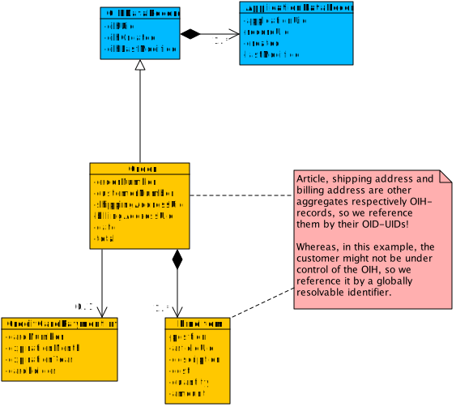

# OIH Data Models

The Open Integration Hub (OIH) provides an asynchronous way of integrating applications and services. Modelling data which is processed by an OIH instance must always consider this fact!

One consequence is, that it must be possible to sent data records to and receive them from an OIH without the need or even possibility for the receiver to eagerly fetch referenced further records of any kind through an API or data store (like the _optional_ OIH Data Hub).

A data model representing a certain professional domain normally consists of numerous entities. Hence, it is necessary to split such a data model into smaller parts to enable the transfer of optimized amounts of data through an OIH:

* __Every OIH-Master-Data-Model (MDM) consists of one or multiple _loosely coupled_ sub-models.__

Although it is necessary to split (especially big) data models into smaller sub-models, it often does not make sense to send each entity on its own, when there is a _high cohesion_ between certain entities. Hence,

* __each sub-model of an MDM can consist of one _or more_ entities.__

## Aggregates

In case the model consists of multiple entities, it *must* be modeled as an __aggregate__:

> Aggregate is a pattern in Domain-Driven Design. A DDD aggregate is a cluster of domain objects that can be treated as a single unit. An example may be an order and its line-items, these will be separate objects, but it's useful to treat the order (together with its line items) as a single aggregate.
>
> An aggregate will have one of its component objects be the aggregate root. Any references from outside the aggregate should only go to the aggregate root. The root can thus ensure the integrity of the aggregate as a whole.
>
> [s. [Martin Fowler: DDD_Aggregate](https://martinfowler.com/bliki/DDD_Aggregate.html)]

# Rules and Regulation for MDMs

To enable the OIH to follow its purpose, the data records being processed have to fulfill some criteria and follow some rules. Some of these rules have to be applied already on the modelling level.

## OIH Data Records

An OIH expects and needs, depending on the scenario and the involved components (e.g. with or without a Data Hub involved), more or less meta data on a data record to integrate two or more applications. This is achieved by modelling each sub-model of an MDM as a so called _OIH Data Record_. The OIHDataRecord defines a superset of mandatory and optional (meta) data for records processed by an OIH instance:


* __Each of the the sub-models of a MDM has to be marked as an *OIHDataRecord*.__

I.e., the root of an MDM's sub-model **must** inherit from / extend _OIHDataRecord_, no matter whether it is modeled as an 
aggregate or as a single entity.

* __Every record passed into an OIH instance must at least be provided with a reference to the record of the application or service being the source of the record__,

called an _OIHApplicationDataRecord_ containing ... 

+ the OIH's identifier for the application, 
+ the record's ID within the application (both mandatory) and
+ optionally its creation and last modification dates within the application.

When receiving such a record from an OIH, there might also be entries of other applications being part of the integrations scenario with the same MDM in the same OIH.

Additionally, depending on the scenario and the involved components again, the OIH itself or a connector (according to rules provided by the OIH __==> TO BE DISCUSSED!__) may also provide an OIH-internal UID for the record, along with the creation and last modification dates of the record within the OIH.

## JSON-Schema

The OIH specifies JSON as the format that data is processed with. Accordingly,

* __[JSON Schema](http://json-schema.org) is the given format to describe MDMs__

in a way an OIH instance is able to validate data at runtime. And, as MDMs are split into sub-models and the records of those sub-models must be processable independently,

* __for every sub-model of an MDM there must be a _seperate_ JSON schema describing the entity or aggregate.__

As there are situations where entities are reused in (i.e. are part of) two or more aggregates, it is of course adequat to encapsulate those entities in an additional schema file and reference them from the several sub-models to avoid redundancy.

### Making a sub-model of an MDM an OIH Data Record on the schema level

There is a predefined JSON-Schema defining the OIHDataRecord (s. [oih-data-record.schema.json](../src/main/schema/oih-data-record.schema.json)).

* __Every sub-model of an MDM must reference the OIHDataRecord schema and "inherit" from the defined type.__

This is done by adding an `allOf`-element to every sub-model's schema:

```javascript
{
  "$schema": "http://json-schema.org/schema#",
  "$id": "http://example.com/schemas/oih/my-model.json",
  "title": "MySubmodelAggregate",
  "allOf": [
    {
      "$ref": "http://openintegrationhub.org/schemas/oih-data-record.json"
    }
  ],
  "properties": {
    ...
```

# Example: the Order aggregate

For a sales application, one could split the data model at least into the following sub-models, each of which built as an aggregate:

* Order
* Address
* Article
* ...

As an example to model an aggregate capable of being processed of an OIH instance, the following diagram shows a simplified order with its line items:



The Order's root defines the model as an OIH Dataset by extending it. This way, the _Order_ entity is the one and only entry point to the aggregate!

The JSON schema for this example is accessible [here](../src/examples/schema/order.schema.json).