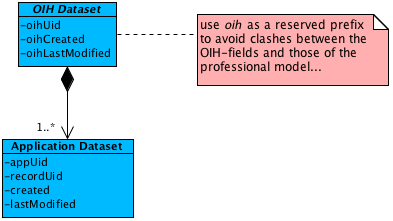

# OIH Datasets
Every OIH-Master-Data-Model consists of one or multiple loosely coupled sub-models. Each of those sub-models has to be marked as an *OID Dataset*:

Every record passed into an OIH instance gets a unique ID controlled by the OIH. Additionally, the OIH adds meta data for every application the record is synchronized with to the dataset:

* the OIH's identifier of the application
* the record's ID within the application
* its creation and last modification dates within the application

Each sub-model consists of one or more entities. In case the model consists of multiple entities, it *must* be modeled as an aggregate:

> Aggregate is a pattern in Domain-Driven Design. A DDD aggregate is a cluster of domain objects that can be treated as a single unit. An example may be an order and its line-items, these will be separate objects, but it's useful to treat the order (together with its line items) as a single aggregate.
>
> An aggregate will have one of its component objects be the aggregate root. Any references from outside the aggregate should only go to the aggregate root. The root can thus ensure the integrity of the aggregate as a whole.
>
> [s. [Martin Fowler: DDD_Aggregate](https://martinfowler.com/bliki/DDD_Aggregate.html)]

Hence, the root of a Master Data Model's sub-model **must** inherit from / extend _OIH Dataset_, no matter whether it is modeled as an aggregate or as a single entity.

# Example: Order aggregate

For a sales application, one could split the data model at least into the following sub-models, each of which built as an aggregate:

* Order
* Address
* Article
* ...

As an example to model an aggregate capable of being processed of an OIH instance, the following diagram shows a simplified order:

The Order's root defines the model as an OIH Dataset by extending it. This way, the _Order_ entity is the one and only entry point to the aggregate!
