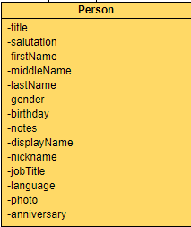
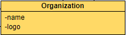
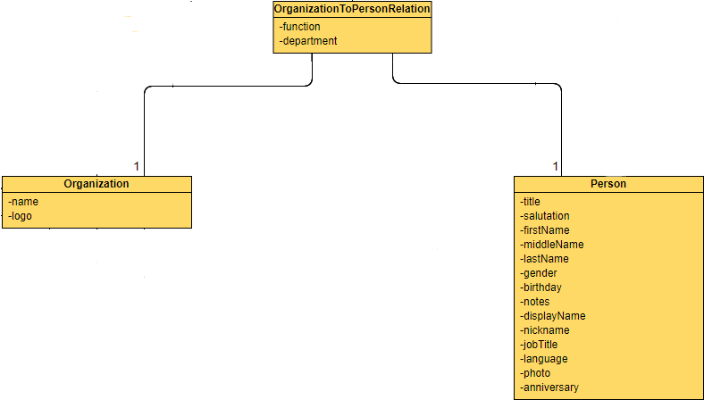
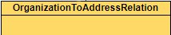
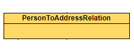
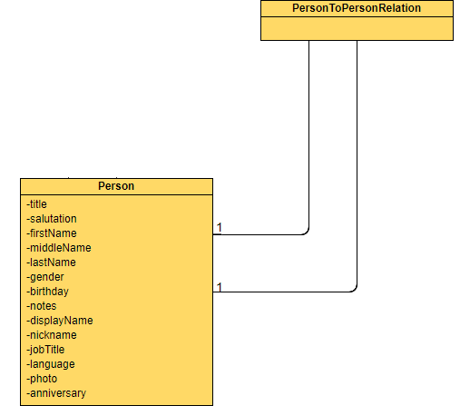
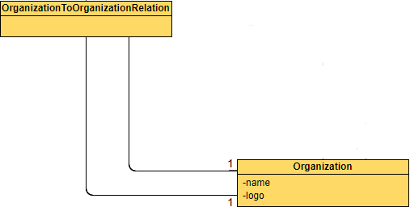
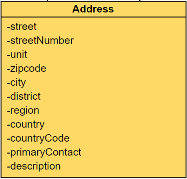

# Introduction
This file is designed to present some common use cases and best practices for using the master data model for addresses for the specific use cases.
Each case includes some exemplary user stories as well as a mapping and a short description.

The cases are seperated by different usage scenarios.

[[TOC]]

# Persons

|User Story Id| User Stories |
|:---| :--- |
|u-AdEx1|As a user I want to synchronize a private person and his/her contact data |

**Example Values:**

|Key|Value|Context|
|:---|:---|:---|
|firstName|Jon|-|
|lastName|Doe|-|
|Phone|+49123456789|Private|
|mobilePhone|+499875612|Private|
|EMail|jon.doe@example.com|Private|

**Best Practice:**

Use the `Person` and `ContactData` objects whereas different phone numbers, email addresses and social media accounts are held within different `ContactData` objects.

# Organizations

|User Story Id| User Stories |
|:---| :--- |
|u-AdEx2|As a user I want to synchronize an organization and his/her contact data |
|u-AdEx3|As a user I want to assign a person to different organizations with different contact data to see different roles or contexts of the same person|

**Example Values:**

|Key|Value|Context|
|:---|:---|:---|
|name|JDub|-|
|logo|http://www.examplelogo.com|-|
|Phone|+49123456789|Support|
|EMail|support@jdub.com|Support|

**Best Practices:**

See best [practice for u-Ex1](#u-ex1) but use the "Organization" object instead of the "Person" Object.

# Relations
## OrganizationsAndPersons

|User Story Id| User Stories |
|:---| :--- |
|u-AdEx3|As a user I want to assign a person to different organizations with different contact data to see different roles or contexts of the same person|

**Example Values:**

|Key|Value|Context|
|:---|:---|:---|
|firstName|Jon|-|
|lastName|Doe|-|
|function|SalesMaanager|Company1|
|department|Sales|Company1|
|email|jondoe@test.com|Company1|

**Best Practices:**

The link between the person and its organization is a "OrganizationToPersonRelationship". The person itself is held as a duplicate for every specific role and is linked via a "PersonToPersonRelationship" and marked as "SamePerson".

## OrganizationAddresses

|User Story Id| User Stories |
|:---| :--- |
|u-AdEx4|As a user I want to lay down any kind of delivery and / or invoice addresses for my customers, to be able to deliver my goods and my invoices to any location. |

**Example Values:**

|Key|Value|Context|
|:---|:---|:---|
|name|JDub|-|
|logo|http://www.examplelogo.com|-|
|Phone|+49123456789|Support|
|EMail|support@jdub.com|Support|
|Address1|Examplestreet 99, 50667 Cologne, Germany|Delivery|
|Address2|Examplestreet 90, 50667 Cologne, Germany|Invoice|

**Best Practice:**

Use the `Organization` object to create the organization. The different addresses are held within different "Address" objects. The link between the organization and an address is modeled by using an `OrganizationToAddressRelation` object. 

## PersonAddresses

|User Story Id| User Stories |
|:---| :--- |
|u-AdEx5|As a user I want to synchronize a person and his or her addresses |

**Example Values:**

|Key|Value|Context|
|:---|:---|:---|
|firstName|Jon|-|
|lastName|Doe|-|
|Phone|+49123456789|Company1|
|mobilePhone|+499875612|Company1|
|EMail|jon.doe@jdub.com|Company1|
|Address1|Examplestreet 99, 50667 Cologne, Germany|Company1|
|Address2|Samplestreet 1, 50931 Cologne, Germany|Private|

**Best Practice:**

Use the `Person` object to create the person. Use the `ContactData` to store the contact data of the person. The different addresses are held within different `Address` objects. The link between the organization and an address is modeled by using an `PersonToAddressRelation` object. 

## PersonRelations

|User Story Id| User Stories |
|:---| :--- |
|u-AdEx6|As a user I want to synchronize two contact persons and their working relationship |

**Example Values:**

|Key|Value|Context|
|:---|:---|:---|
|id|8|-|
|firstName|Jon||
|lastName|Doe|-|
|supervisor|3|-|

|Key|Value|Context|
|:---|:---|:---|
|id|3|-|
|firstName|Foo|-|
|lastName|Bar|-|
|supervisor|1|-|

**Best Practices:**

You have to use the needed attributes from the `Person` object for both persons.The link between the persons is a `PersonToPersonRelationship` e.g. with a **label = supervisor**.

## OrganizationRelations

|User Story Id| User Stories |
|:---| :--- |
|u-AdEx6|As a user I want to synchronize two organizations and their business relationship |

**Example Values:**

|Key|Value|
|:---|:---|
|id|7|
|name|JDub|
|logo|http://www.examplelogo.com|
|subsidiary|18|

|Key|Value|
|:---|:---|
|id|18|
|name|DHub|
|logo|http://www.examplelogo.org|
|subsidiary|-|

**Best Practice:**

You have to use the needed attributes from the `Organization` object for both organizations.The link between the organizations is a `OrganizationToOrganizationRelationship` e.g. with a **label = subsidiary**.

# Addresses

|User Story Id| User Stories |
|:---| :--- |
|u-AdEx7|As a user I want to synchronize my Addresses|

**Extenstion 1 (u-AdEx7.1):**

Proprietary system has a unique ID stored for each address.

**Extenstion 1 (u-AdEx7.2):**

Proprietary system does not have a unique ID stored for each address.

**Example Value (u-AdEx7.1):**

|Key|Value|
|:---|:---|
|id|77|
|street|example street|
|streetNumber|5|
|unit|a|
|zipcode|50678|
|city|cologne|
|district|altstadt|
|region|nrw|
|country|germany|
|countryCode|de|
|primaryContact|-|
|description|-|

**Example Value (u-AdEx7.2):**

|Key|Value|
|:---|:---|
|street|example street|
|streetNumber|5|
|unit|a|
|zipcode|50678|
|city|cologne|
|district|altstadt|
|region|nrw|
|country|germany|
|countryCode|de|
|primaryContact|-|
|description|-|

**Best Practice (u-AdEx7.1):**

Use the `Address` object to store the address information. The id is stored within the `applicationDataRecord` object as a **recordUid**.

**Best Practice (u-AdEx7.2):**
Use the `Address` object to store the address information. As there is no unique Id that can be provided by the application, the **recordUid** from the `applicationDataRecord` must be mocked/calculated. This is done by performing the following steps:

**recordUid** = organization or person Id from the system (wether the address belongs to) + **.** + Iterator to count the addresses that belong to this organization or person.

**Example:** 
- 1st address: 32.0
- 2nd address: 32.1
- 3rd address: 32.2

Whereas 32 is the id of the relating person, `.` is the delimiter and 0,1 & 2 are the 1st, 2nd and 3rd addresses of the person with id 32. Each of these addresses needs to be stored in a seperate address object.

To simplify the process of attaching the address to a person or organization `personToAddressRelation` objects or `organizationToAddressRelation` object should be created.

