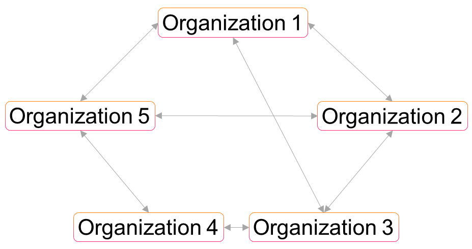
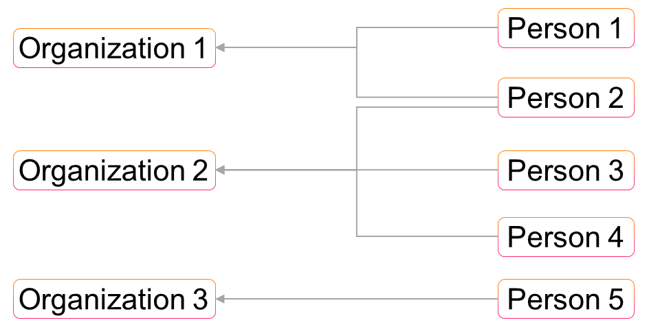

**Table of Contents**
<!-- TOC depthFrom:1 depthTo:6 withLinks:1 updateOnSave:1 orderedList:0 -->

- [Introduction](#introduction)
- [Basic Ideas](#basic-ideas)
	- [Duplicates](#duplicates)
	- [Relations](#relations)
- [Considered Standards](#considered-standards)
	- [vCard](#vcard)
	- [Postal Standards](#postal-standards)
	- [Electronic Data Interchange (EDIfact)](#electronic-data-interchange-edifact)
	- [IBM Infosphere](#ibm-infosphere)
- [Operations](#operations)
- [Content](#content)
	- [UML Diagram](#uml-diagram)
	- [JSON Schema](#json-schema)
	- [Description Table](#description-table)
- [Additional Content](#additional-content)

<!-- /TOC -->
# Introduction

In the following the master data model for the domain addresses is explained in detail. As for every Open Integration Hub Master Data Model, an UML class diagram, a JSON schema as well as a description table exists.

# Basic Ideas

The master data model for the addresses consists of different types of objects. We named them organizations and persons with reference to the real world objects.

Organizations can be companies or associations. Persons can be contacts in organizations or employees of your own company.

With this dividing in persons and organizations we are able to solve different problems and use cases, so we can assign for example a different amount of persons to an organization, can assign on person to different organizations or can assign relations between persons.

From this real world view we derive the two main objects and go deeper in the modeling.

## Duplicates

There are some use cases where traditional data models are having problems. For example you
have a person, who occupies different roles in different organizations and you must be able
to get in contact with this person over the right contact channel.

So you have a person who is the ceo in a company you are dealing with and he is also in the board of an association.
If you want to mail him infos in his role as a CEO you want to use the company mail address
and if you want to mail him as a board member, you want to use the mail address from the association.
Some tools will use a label for different kind of mail accounts, but this does not scale.

The specific user stories for this problem could be like:

| User story: | As a user I want to see the function of a person in his organization. |
| :--- | :--- |

| User story: | As a user I want to assign a person to different organizations with different contact data to see different roles of the same person. |
| :--- | :--- |

| User story: | As a user I want to store same persons in different organizations, to get in contact with them currently at the time with the particular contact data. |
| :--- | :--- |

Other problems raised by use cases, for example about the different locations of one organization, the structure of a group of companies etc., arise the same questions.

Our solution to solve this problem is by allowing duplicates and link them by our relation modeling.

For the example above, we will store the person with his contact details for his ceo role in the company and store another entity of this person for his role as a board member in the association. Then we link them together via a relation and describe them as a "same person"-relation.

## Relations

Dealing with relations is a crucial requirement in the address management.

Generally there are three types of relations:
- Persons to organizations
- Persons to persons
- Organizations to organizations

If the task would only be a relation between the two objects persons and organizations, we could directly link them together. But we need a naming of this relation and users want to categorize single entries for the description of the relations of a users own organization to other organizations or persons or to see the function of a person in his organization. Therefore we need a more generic approach for storing relations, categories, tags or other distinguishing features. That's the reason, why we introduce a specific object for this.

With this we can solve for example the following user stories:

| User story: | As a user I want to see the structure of a group of companies, to get a better overview of my business dealings.  |
| :--- | :--- |

| User story: | As a user I want to assign one or more persons to an organization to communicate with all contacts of an organization |
| :--- | :--- |

| User story: | As a user I want to assign relations between contact persons of my customers to get an overview of their hierarchy. |
| :--- | :--- |

| User story: | As a user I want to see, if a specific person in an organization is the same person as in another organization |
| :--- | :--- |

In the following diagrams you can see the different relationships between persons, organizations and persons to organizations.

### Use Case -  Relationships among Organizations

### Use Case -  Relationships among Organizations

### Use Case -  Relationships between Organizations and Persons

# Considered Standards
In the following we list all considered standards. In addition, it is described if and how the specific standard was incorporated into the model.

## vCard
Will follow soon.

## Postal Standards
Will follow soon.

## Electronic Data Interchange (EDIfact)
Will follow soon.

## IBM Infosphere
Will follow soon.

# Operations
CRUD functionalities can be performed based on the model.

# Content

## UML Diagram

## JSON Schema

- `Person` Schema: [personV2](../../src/main/schema/addresses/personV2.json)
  - Technical description of a person object
- `Organization` Schema: [organizationV2](../../src/main/schema/addresses/organizationV2.json)
  - Technical description of an organization object
- `Relation` Schema: [relationV2](../../src/main/schema/addresses/relationsV2.json)
  - Technical description of a relation object
- `Shared Definitions` Schema: [shared-definitionsV2](../../src/main/schema/addresses/sharedDefinitionsV2.json)
  - Technical description of shared definitions of persons and organizations

## Description Table

In addition to the uml class diagram, this folder contains a [description table](AddressModelV2Description.md) which includes the following information for each attribute:
- Type
- Properties
- Short description
- Example values
- Enumeration options (if attribute is an enumeration)

# Additional Content

- `MappingTableSnazzyContactsAddressModel.md`: A concrete mapping between the data model of SnazzyContacts and the master data model for addresses.
