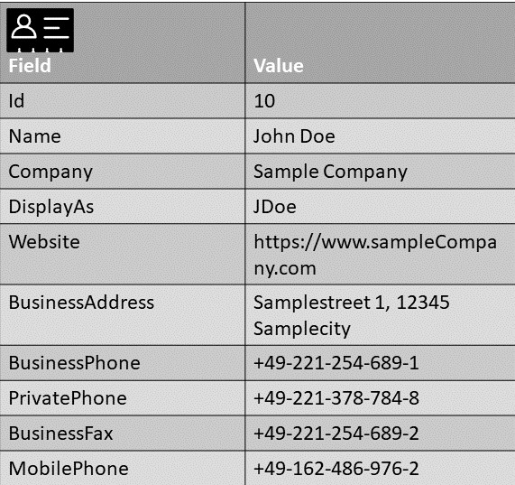
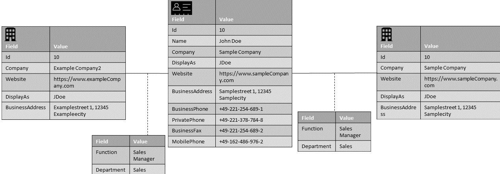

# Introduction
This file is designed to present some common use cases and best practices for using the master data model for addresses for the specific use cases.
Each case includes some exemplary user stories as well as a mapping and a short description.

The cases are seperated by different usage scenarios.

## Minimal Scenario

|User Story Id| User Stories |
|:---| :--- |
|u-Ex1|As a user I want to synchronize a private person and his/her contact data |
|u-Ex2|As a user I want to synchronize an organization and his/her contact data |
|u-Ex3|As a user I want to assign a person to different organizations with different contact data to see different roles or contexts of the same person|

### Best Practice
#### u-Ex1
Just use the needed attributes from the "Person" object and from the "Address" object. The different phone numbers, email addresses and social media accounts are held within different "ContactData" objects.

#### u-Ex2
See best [practice for u-Ex1](#u-ex1) but use the "Organization" object instead of the "Person" Object.

#### u-Ex3
The link between the person and its organization is a "OrganizationToPersonRelationship". The person itself is held as a duplicate for every specific role and is linked via a "PersonToPersonRelationship" and marked as "SamePerson".

***

## Using Relations
### OrganizationToOrganizationRelationships

| User Stories |
| :--- |
|As a user I want to lay down any kind of delivery and / or invoice addresses for my customers, to be able to deliver my goods and my invoices to any location. |

#### Example Values

#### Best Practice
The organization itself is held as a duplicate. The different addresses are held within a "Address" object. The link between the organizations is a "OrganizationToOrganizationRelationship" and marked as "delivery address" or "invoice address".

### PersonToPersonRelationships

| User Stories |
| :--- |
|As a user I want to synchronize a contact person from a company and his/her contact data |

#### Example Values

#### Best Practice
You have to use the needed attributes from the "Person" object, from the "Organization" object and from the "Address" object. The different phone numbers, email addresses and social media accounts are held within different "ContactData" objects. The link between the person and its organization is a "OrganizationToPersonRelationship".

***

## Using Duplicates

| User Stories |
| :--- |
|As a user I want to see which person has a role in different organizations  |
### Example Values

### Best Practice
The link between the person and the different organizations is done via the object "OrganizationToPersonRelationship". The person itself is held as a duplicate for every specific role and is linked via a "PersonToPersonRelationship" and marked as "SamePerson".
