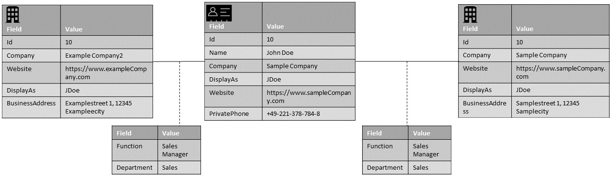
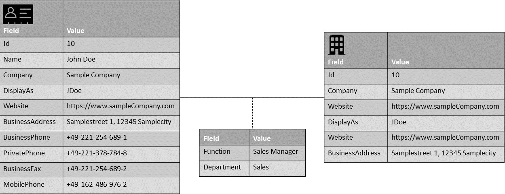

# Introduction
This file is designed to present some common use cases and best practices for using the master data model for addresses for the specific use cases.
Each case includes some exemplary user stories as well as a mapping and a short description.

The cases are seperated by different usage scenarios.

## Minimal Scenario

| User Stories |
| :--- |
|As a user I want to synchronize a private person and his/her contact data |

### Example Values

## Using Relations

| User Stories |
| :--- |
|As a user I want to synchronize a person and all his/her relations to different organizations |

### Example Values

## Using Duplicates

| User Stories |
| :--- |
|As a user I want to synchronize a person and his/her contact data within different contexts of different organizations |
### Example Values

## Full scenario

| User Stories |
| :--- |
|As a user I want to synchronize a person and all his/her relations to different organization as well as his/her contact data within the context of different organizations |

### Example Values

