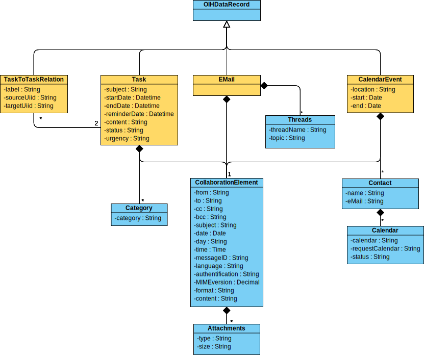

**Table of Contents**

<!-- TOC depthFrom:1 depthTo:6 withLinks:1 updateOnSave:1 orderedList:0 -->

- [Introduction](#introduction)
- [Basic Idea](#basic-idea)
- [Considered Standards](#considered-standards)
	- [Standard for e-mail](#standard-for-e-mail)
	- [Standard for calendar](#standard-for-calendar)
	- [Standard for tasks](#standard-for-tasks) 
- [Operations](#operations)
- [Content](#content)
	- [UML Diagram](#uml-diagram)
	- [JSON Schema](#json-schema)
	- [Description Table](#description-table)

<!-- /TOC -->

# Introduction

In the following the master data model for the domain collaboration is explained in detail. As for every Open Integration Hub Master Data Model, an UML class diagram, a JSON schema (soon) as well as a descrption table exists.

# Basic Idea
The first version of the collaboration model will include models for e-mail, calendarevents and tasks.
Through community feedback these were identified as the most important models in the collaboration domain.

Because all three of the models have identical properties they will be set in relation to an central element.
The models will inherit the most important properties from this element and extensions will be made if neccessary.
The idea behind this: collaboration relies on certain knowledge factors to establish an effective use. One has to know which person, when and with which properties created a certain element.

# Considered Standards

## Standard for e-mail
Finding a standard for e-mail properties proved to be difficult. Standards in the area of e-mail functions often specify the protocol, but not the properties of the e-mail. Therefore a analysation of different e-mail systems was made.
Due to the extensive professional use of Microsoft Outlook the chosen e-mail standard is derived mostly from Outlook.

## Standard for calendar
An existing standard for calendarevents is "iCalender" (RFC 5545). In the following standard the properties of "iCalender" are incorporated and extended.

## Standard for tasks
There is no existing standard for tasks.

# Operations
CRUD functionalities can be performed based on the model.

# Content

## UML Diagram

## JSON Schema

- `EMail` Schema: [email](../../src/main/schema/collaboration/email.json)
  - Technical description of an E-Mail object
- `CalendarEvent` Schema: [calendarevent](../../src/main/schema/collaboration/calendarevent.json)
  - Technical description of an CalendarEvent object
- `Task` Schema: [task](../../src/main/schema/collaboration/task.json)
  - Technical description of an Task object
- `CollaborationElement` Schema: [collaborationelement](../../src/main/schema/collaboration/collaborationelement.json)
  - Technical description of shared definitions of e-mail, task and calendar in the CollaborationElement object
- `TaskToTaskRelation` Schema: [taskToTaskRelation](../../src/main/schema/collaboration/taskToTaskRelation.json)
  - Technical description of a task to task relation object

## Description Table

In addition to the uml class diagram, this folder contains a [description table](CollaborationModelDescription.md) which includes the following information for each attribute:
- Type
- Properties
- Short description
- Example values
- Enumeration options (if attribute is an enumeration)
