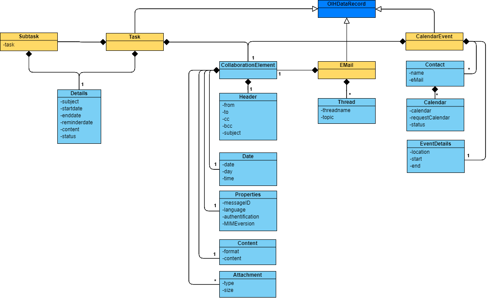

The purpose of this document is to provide a template to consistently describe all **Open Integration Hub Master Data Models**.

For a template conform example please look at the [Master Data Model Addresses](https://github.com/openintegrationhub/Data-and-Domain-Models/blob/master/MasterDataModels/Addresses/README.md).

---

**Table of Contents**

<!-- TOC depthFrom:1 depthTo:6 withLinks:1 updateOnSave:1 orderedList:0 -->

- [Introduction](#introduction)
- [Basic Ideas](#basic-ideas)
	- [Basic Idea 1](#basic-idea-1)
	- [Basic Idea 2](#basic-idea-2)
- [Considered Standards](#considered-standards)
	- [Standard 1](#standard-1)
	- [Standard 2](#standard-2)
- [Operations](#operations)
- [Content](#content)
	- [UML Diagram](#uml-diagram)
	- [JSON Schema](#json-schema)
	- [Description Table](#description-table)
- [Additional Content](#additional-content)

<!-- /TOC -->

# Introduction

In the following the master data model for the domain _{your domain}_ is explained in detail. As for every Open Integration Hub Master Data Model, an UML class diagram, a JSON schema as well as a descrption table exists.

# Basic Ideas
_Please describe the basic logic and ideas of the Master Data Model_
## Basic Idea 1
...

## Basic Idea 2
...

# Considered Standards
_Please describe all other standards that were created during the creation process_
## Standard 1
...

## Standard 2
...

# Operations
_Which functionalities can be performed on the model? Standard: CRUD_

# Content

## UML Diagram

## JSON Schema

_Please provide link(s) to the JSON schemas of the model._

## Description Table

_Please provide a link to the description table of the model._

# Additional Content

_If existing, please provide additional content._
