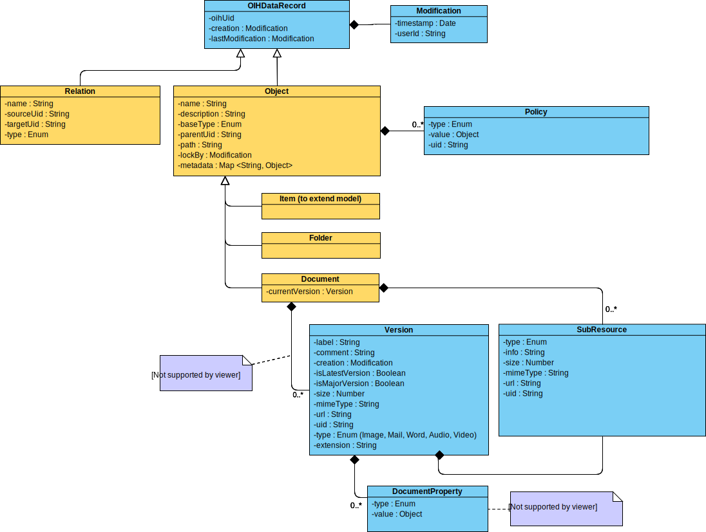
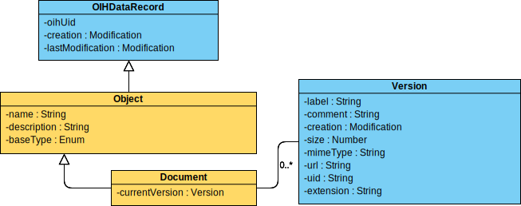

**Table of Contents**

<!-- TOC depthFrom:1 depthTo:6 withLinks:1 updateOnSave:1 orderedList:0 -->

- [Introduction](#introduction)
- [Basic Ideas](#basic-ideas)
	- [Managing documents by specialized systems](#managing-documents-by-specialized-systems)
	- [Business services creating documents](#business-services-creating-documents)
	- [Business services consuming documents](#business-services-consuming-documents)
- [Considered Standards](#considered-standards)
	- [WebDAV](#webdav)
	- [CMIS](#cmis)
- [Operations](#operations)
- [Content](#content)
	- [UML Diagram](#uml-diagram)
	- [JSON Schema](#json-schema)
	- [Description Table](#description-table)
- [Additional Content](#additional-content)

<!-- /TOC -->

# Introduction

In the following the master data model for the domain `Documents` is explained in detail. As for every Open Integration Hub Master Data Model, an UML class diagram, a JSON schema as well as a descrption table exists.

# Basic Ideas

One challenge of this model is to fit a wide array of services dealing with documents.
The features provided by heterogeneous services like Dropbox and other more advanced systems like SharePoint or ELO are far apart.

In order to be suitable for all scenarios, this model is split into several implementations.

* `Basic`   		Sharing documents between services
* `Comfort`			Sharing documents and metadata between services
* `Extended`		Sharing documents, metadata, policies and sub-resources betweeen services 

## Managing documents by specialized systems

The following table classifies the complexity of document management systems currently available.

|Type|Description|Example|
|---|---|---|
|File storage|A system that can store documents (folders/ documents) in a hierarchically organized structure including limited metadata capabilities|FTP, S3, Network fileshare|
|Online file share|A system that can store information (folders/ documents) in a hierarchically organized structure. Allows sharing content easily. Some services do provide metadata capabilities.|DropBox, OneDrive, Box|
|DMS|A system that stores and organizes documents based on additional metadata or hierarchically organized structures.||
|ECM/EIM|A system that captures, stores, delivers, manages and organizes information based on additional metadata or hierarchically organized structures. In most cases DMS functionality can be seen as a fundamental part of these services.|Alfresco, ELO, M-Files, OpenText, SharePoint|

## Business services creating documents

In addition to systems that have been specifically designed to capture, store, deliver and manage documents and informations, there are additional services that have been designed in order to produce content.

|Service/ System|Sample document types|
|---|---|
|Inbox services|Incoming Invoices, Notifications, ...|
|ERP|Outgoing Invoices, Purchase Orders, ...|

| User Stories |
| :--- |
| As a user I want to automatically send an email with the invoice created by the ERP system. |
| As a user I want to automatically store generated outgoing documents in the document management system. |
| As a user I want to use inbox services for digitalizing invoices for further processing. |

## Business services consuming documents

From a companywide perspective, there are a variety of systems that generate or recieve documents that are related to business transactions of other systems. If a document management system is used, these documents are centralized in a repository that contains information that refers to the business transaction.

Therefore ERP or CRM systems can view a list of related documents from document management systems or third party sources. The following table lists systems that create business transactions.

|Service/ System|Sample document types|
|---|---|
|CRM|Invoices, Purchase Orders, Billing documents, E-Mails, Communication, etc.|
|ERP|Invoices, Purchase Orders, Billing documents, etc.|

| User Stories |
| :--- |
| As a user I want to view stored documents of the current invoice transaction in the ERP system. This gives me additional information like attached terms and conditions or the related delivery docket. |
| As a user I want to add additional documents while displaying the customer record in the CRM system. |
| As a user I want to pass all documents uploaded to a specific DropBox folder to be passed to the ERP system. |

# Considered Standards

## WebDAV

Reference: https://tools.ietf.org/html/rfc4918

This standard is probably the most widely used one related to document authoring and versionning. 
It is of widespread use and based on an extension of the HTTP protocol.
It however suffers two drawbacks. First, it requires an extension in the web server itself, and cannot be built using plain HTTP.
Second, the protocol and its XML format are both non-trivial and verbose. 
The model presented here attempts to be compatible with it, but also extends it with a wide array of optional features.

## CMIS

Reference: http://docs.oasis-open.org/cmis/CMIS/v1.1/CMIS-v1.1.html

This standard is used in the "Document Management Industry" to some extend.
The protocol is based on SOAP and is 335 pages long. In other words, small companies might face a challenge due to its scope and complexity.

# Operations

CRUD functionalities can be performed based on the model.

This folder contains a draft of [operations](DocumentModelDescription.md) that can be used for building REST webservices.

# Content

## UML Diagram

The extended model specification does contain all properties that are required in order to handle additional functionalities of DMS/ECM/EIM systems. Metadata definitions can be additionally queried. Therefore a [specification of generic metadata](DocumentModelMetadataDescription.md) describes how information can be passed.

The basic model specification describe a basic implementation for sharing documents and files without the need of handling metadata or additional information.

## JSON Schema

JSON Schema definitions will follow as soon as the model has been reviewed.

## Description Table

In addition to the uml class diagram, this folder contains a [description table](DocumentModelDescription.md) which includes the following information for each attribute:
- Type
- Properties
- Short description
- Sample values
- Enumeration options (if attribute is an enumeration)

