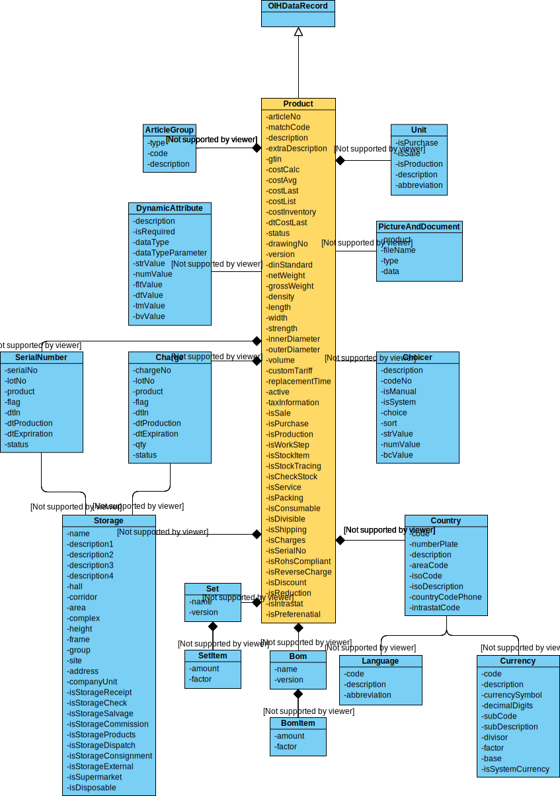

# Introduction

In the following the master data model for the domain products is explained in detail. As for every Open Integration Hub Master Data Model, an UML class diagram, a JSON schema as well as a descrption table exists.

**Table of Contents:**

- [Introduction](#introduction)
    - [Basic Ideas](#basic-ideas)
    - [Considered Standards](#considered-standards)
        - [BiPro](#bipro)
        - [Oagis](#oagis)
    - [Operations](#operations)
    - [Content](#content)
        - [UML Diagram](#uml-diagram)
        - [JSON Schema](#json-schema)
        - [Description Table](#description-table)
    - [Additional Content](#additional-content)

## Basic Ideas

## Considered Standards

### BiPro

Will follow soon.

### Oagis

Will follow soon.

## Operations

CRUD functionalities can be performed based on the model.

## Content

### UML Diagram

### JSON Schema

- `Product` Schema: [product](../../src/main/schema/products/product.json)
  - Technical description of a product object

### Description Table

In addition to the uml class diagram, this folder contains a [description table](ProductModelDescriptionTable.md) which includes the following information for each object:

- Type
- Properties
- Short description
- Example values
- Enumeration options (if attribute is an enumeration)

## Additional Content

- No additional content
