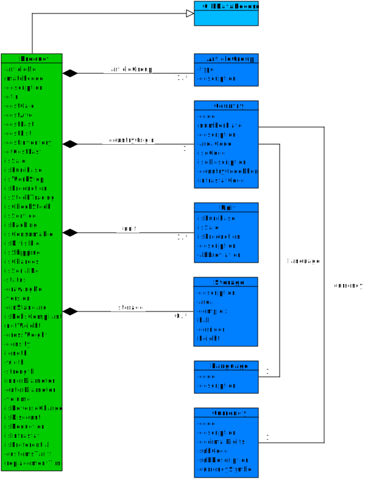

**Table of Contents**

<!-- TOC depthFrom:1 depthTo:6 withLinks:1 updateOnSave:1 orderedList:0 -->

- [Introduction](#introduction)
- [Basic Ideas](#basic-ideas)
	- [Multiple Types](#multiple-types)
- [Content](#content)
	- [UML Diagram](#uml-diagram)
	- [JSON Schema](#json-schema)
	- [Description Table](#description-table)
- [Additional Content](#additional-content)

<!-- /TOC -->

# Introduction

In the following the master data model for products is explained in detail. As for every Open Integration Hub Master Data Model, an UML class diagram, a JSON schema as well as a descrption table exists.

# Basic Ideas

_Beschreibung der zugrunde liegenden Logik. Z.b. "Produkt ist Einkaufsprodukt als auch Fertigungsprodukt_
## Multiple Types

**User Story:** As a user I want to....

_Ggf. mit konkretem Beispiel_

# Content

## UML Diagram

## JSON Schema

- `Product` Schema: [product](../../src/main/schema/products/product.json)
  - Technical description of a product object

## Description Table
**Coming soon**

In addition to the uml class diagram, this folder contains a [description table](AddressModelV2Description.md) which includes the following information for each attribute:
- Type
- Properties
- Short description
- Example values
- Enumeration options (if attribute is an enumeration)

# Additional Content

- No additional content
