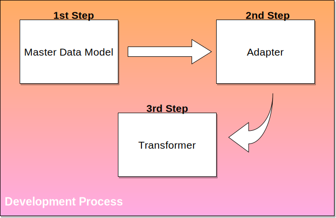

**Table of Contents:**

<!-- TOC depthFrom:1 depthTo:6 withLinks:1 updateOnSave:1 orderedList:0 -->

- [Procedure](#procedure)
- [Master Data Model](#master-data-model)
	- [Guidelines](#guidelines)
	- [Examples](#examples)
	- [Tooling](#tooling)
- [Connectors](#connectors)
	- [Adapter](#adapter)
		- [Guidelines](#guidelines)
		- [Examples](#examples)
		- [Testing](#testing)
		- [Deployment](#deployment)
	- [Transformer](#transformer)
		- [Guidelines](#guidelines)
		- [Examples](#examples)
		- [Testing](#testing)
		- [Deployment](#deployment)

<!-- /TOC -->

# Procedure

In order to simplify the onboarding process, the following document describes how to proceed when developing a master data model and a connector.

Within the 2nd phase new data models for the relating domain and a connector (adapter & transformer) must be developed.
It it suggested to perform the following steps in the given order:

1. Development of the standard data model
2. Development of an application specific adapter
3. Development of an application specific transformer

(If enough ressources are available step 1 & 2 can be performed in parallel). As the transformer requires the input from the adapter and needs target data model to perform the mapping, steps 1 and 2 must be performed first before implementing the transformer.

# Master Data Model
## Guidelines

- [Introduction to Open Integration Hub Master Data Models](https://github.com/openintegrationhub/Data-and-Domain-Models/tree/master/MasterDataModels#2-what-is-a-master-data-model)
- [&quot;OIH Data Records&quot;](https://github.com/openintegrationhub/Data-and-Domain-Models/tree/master/MasterDataModels#41-oih-data-records)
- [Required Output](https://github.com/openintegrationhub/Data-and-Domain-Models/tree/master/MasterDataModels#6-rules-and-regulations-for-omdms-provided-by-the-oih-community)

As described in &quot;required output&quot; a UML class diagram, Json schemas and additional descriptions (textual/diagrams) need to be provided. To enhance the readability and comprehensibility and to create a consistent description across all domains please use the following template to textually describe the master data model:

- [Readme Template](https://github.com/openintegrationhub/Data-and-Domain-Models/blob/master/MasterDataModels/ReadmeTemplate.md)

This textual documentation should include all relevant information (e.g. the underlying logic) so that it can be understood by third parties without further explanation.

## Examples
- [Master Data Model Addresses](https://github.com/openintegrationhub/Data-and-Domain-Models/blob/master/MasterDataModels/Addresses/README.md)
- [Master Data Model Addresses Description Table](https://github.com/openintegrationhub/Data-and-Domain-Models/blob/master/MasterDataModels/Addresses/AddressModelV2Description.md)

## Tooling
- [Visual Paradigm](https://www.visual-paradigm.com/) for UML diagrams

# Connectors

A connector connects a software solution to the Open Integration Hub. It consists of two distinct parts, namely adapter and transformer. The purpose of a connector is to enable an application to interact with the Open Integration Hub. It contains different functionalities e.g. to fetch and transform data. These functionalities are further explained in the sections [adapter](#adapter) and [transformer](#transformer).

A connector is only a coherent part on a logical level.
From an architectural stand point both parts have to be implemented as seperate [Docker containers](https://www.docker.com/).

## Adapter

### Guidelines

- [Adapter Guide](https://github.com/openintegrationhub/Connectors/blob/master/Adapters/AdapterGuide.md) (Starting point. It explains the problems which an adapter must solve and the recommended way of solving those problems.)
- [Desired Adapter Behaviors](https://github.com/openintegrationhub/Connectors/blob/master/Adapters/AdapterChecklists/DesiredAdapterBehaviors.md) (Lists what behaviors should be present in a complete adapter)
- [StandardizedActionsAndTriggers](https://github.com/openintegrationhub/Connectors/blob/master/Adapters/AdapterBehaviorStandardization/StandardizedActionsAndTriggers.md#lookup-object-by-fields) (Describes and explains standardized triggers and actions from the desired adapter behavior document)
- [Adapter Functionality Checklist](file:///tmp/d20180424-4-347rzp/to%20track%20connector%20completeness%20based%20on%20the%20functionality%20provided%20by%20the%20API) (To track connector completeness based on the functionality provided by the API)
- [Description and Documentation Guidelines](https://github.com/openintegrationhub/Connectors/blob/master/Adapters/AdapterChecklists/AdapterDescriptionAndDocumentationChecklist.md) (Describes what should be documented in the adapter README.md,component.json and similar files.)

### Examples

These are component templates which act as the first step of the development for creating an adapter.
- [Example adapter for nodejs](https://github.com/elasticio/petstore-component-nodejs)
- [Example adapter for java](https://github.com/elasticio/petstore-component-java)

### Testing

- [Requirements to Test or Build an Adapter](https://github.com/openintegrationhub/Connectors/blob/master/Adapters/AdapterChecklists/RequirementsToTestOrBuildAnAdapter.md)

### Deployment
_Current status:_ Upload the transformer on the Elastic.io plattform

## Transformer

### Guidelines

- [Introduction to Transformer](https://github.com/openintegrationhub/Connectors/blob/master/Transformer/README.md)

### Examples
- Work in progress

### Testing
- [Requirements to Test or Build an Adapter](https://github.com/openintegrationhub/Connectors/blob/master/Adapters/AdapterChecklists/RequirementsToTestOrBuildAnAdapter.md) (Currently the same requirements as for adapters)

### Deployment
- _Current status:_ Upload the transformer on the Elastic.io plattform
