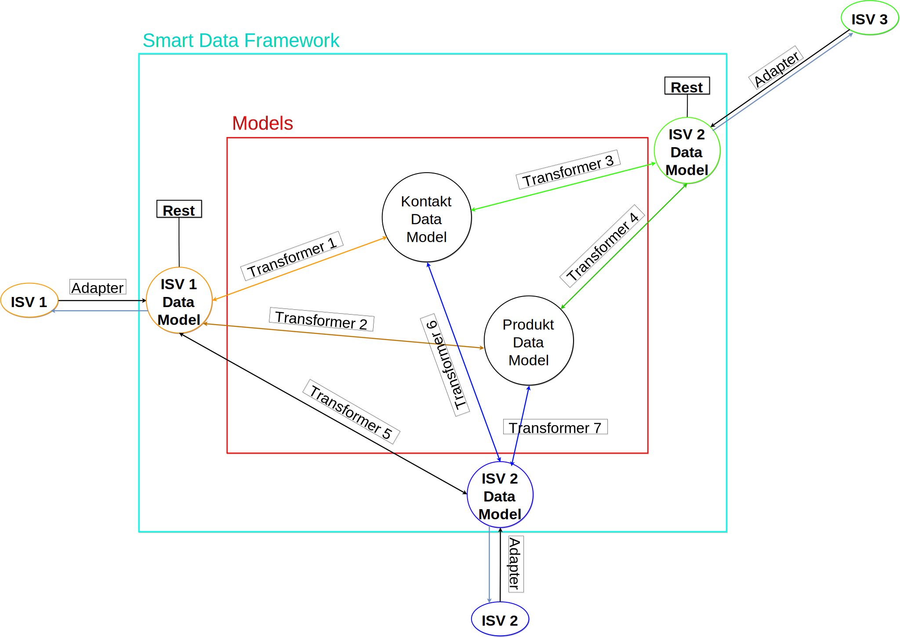

# Protocol
**Attendees:** Lutz, Raphael, Andy, Robin, Stephan, Frank, Renat, Philipp
**Absent:** Andreas, Josef

## Tasks of the Workgroup
- The workgroup helps to realize the POC 1 - POC 3 from the [roadmapV1](https://github.com/openintegrationhub/Architecture/blob/roadmap/Roadmap/RoadmapV1.md)
- Analytical approach to improve the master data models
  - Evaluating the master data models by comparing them to existing standards (EDIFACT, BiPRO, InfoSphere, etc.)
  - Deriving mapping rules to map the "OIH standard" against existing Standards
- Technical implementation is done by the _architecture workgroup_. See [repository architecture workgroup](https://github.com/openintegrationhub/Architecture)
- Rules and regulations of the data Models
  - How do the data models evolve? E.g. What is the process to decide on suggested changes (Versioning)?
  - How shall new data models be developed
- Documentation for the implementation of transformer (mapping)  
- The workgroup helps to achieve the results of milestone 2 by contributing to the "Access to the OIH platform 0.5" and "Document procedure model for integration cloud provider"

## Current Status of the Models
- Presentation of the results for milestone 1
- Derived information for the _architecture workgroup:_ The architecture must consider that multiple data models (will) exist

## Roadmap
- Currently the POC 1 is not finished because the integration between SilverERP and Snazzy Contacts is not working
- Difference between POC 1 and POC 2 is the application of the adapter quality guidelines on the SilverERP and Snazzy Contacts adapters
- A documentation of the current status of POC 1 is missing yet (See _derived tasks_)
- Documentation of the meta models is not part of the API

## Intital Specs of the Smart Data Framework
See the current status of the specs under [DataHub.md](https://github.com/openintegrationhub/Microservices/blob/datahub_specs/DataHub.md)

- Raw data is syntactically transformed data
- Decoupling between adapter and transformer
  - Adapter can talk to the transformer and/or to other adapters. Thus semantic transformation via the transformer and individual integrations are enabled
  -  (Adapter holds syntactically transformed data). Not mandatory. ISV doesn't have to upload the data into the raw data storage.
- Meta Data API uploads the information about the metadata (list of objects)
- Data management API uploads the actual data (data records)

Within the scope of this topic the following illustrations was drawn:

## Further Thoughts
- Synchronization of roles & rights / user & user roles has to be enabled by the open integration hub. It will most likely by realized by an additional domain such as addresses and products
  - The identities Basaas wants to synchronize are not stored within the identity management but will be realized through the aforementioned additional domain
- Various aspects of the synchronization of user & roles are needed. See derived tasks "exchange ideas regarding the synchronization of user & roles"        
Distinction between identity management of the open integration hub (minimal functionality to manage identities) and the domain "roles & right / user & roles"

## Next Steps / Derived Tasks
- [ ] Elaborate common structure for the documentation of the master data models (JSON-Schema, UML diagrams, textual description) **Raphael + Lutz**
- [ ] Expand and further describe the superordinated structure for the domain models (see _OIHDataRecord_) **Raphael + Lutz**
- [ ] Elaborate/expand rules and regulations for the evolution of master data models (How do the data models evolve?, How shall new models be created, how often are new versions created, ...) **Raphael + Lutz**
- [ ] Consider the "Meta-Meta Model" (Definition used by **Renat**) with respect to the capabilities of the JSON Schema (E.g. types like date, currency, etc.)
- [ ] Compare master data models with existing standards (EDIFACT, BiPRO, InfoSphere, etc.) **Raphael**
- [ ] Document the current status of the POC 1 (The following steps break down the concrete tasks) **Andy + Josef**
  - [ ] Create API documentation / interface documentation
  - [ ] Create JSONata expression (mapping)
  - [ ] Create a mapping table
  - [ ] Document which elastic.io components where used and why
  - [ ] Compare the documentations of YQ and Wice and unify them
- [ ] For POC 2: Apply the adapter quality guidelines on the adapters by YQ and Wice **Philipp**
- [ ] Decide on technical realization of the connectors **Franz**
- [ ] (Technical) realization of the integration node from [POC 2](https://github.com/openintegrationhub/Architecture/blob/roadmap/Roadmap/RoadmapV1.md#poc-2--point-to-point-integration-of-isv-applications-using-connectors) **Franz + Igor**
- [ ] (Technical) realization of the smart data framework with master data management (mdm) **Franz + Igor**
- [ ] Exchange ideas regarding the synchronization of user & roles ** Lutz + Selim **
