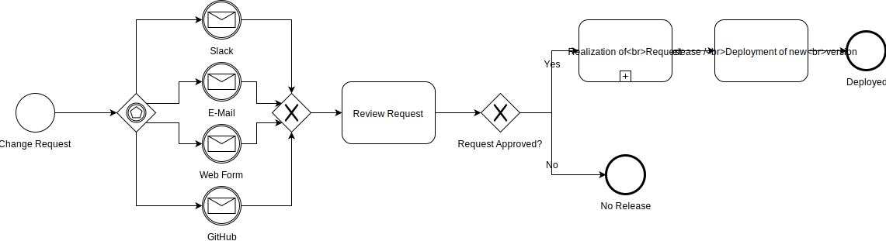

  

The revolution in data synchronization — the Open Integration Hub enables simple data synchronization between any software applications and thus accelerates digitalisation

Visit the official [Open Integration Hub homepage](https://www.openintegrationhub.org/)

## Table of Content
<!-- TOC depthFrom:2 depthTo:6 withLinks:1 updateOnSave:1 orderedList:0 -->

- [Table of Content](#table-of-content)
- [Introduction](#introduction)
- [Contribution](#contribution)
	- [Getting Started](#getting-started)
		- [Propose a Model Change](#propose-a-model-change)
		- [Contribute a new Model](#contribute-a-new-model)
	- [Contribution Guidelines](#contribution-guidelines)
	- [Code of Conduct](#code-of-conduct)
- [Contact](#contact)
- [Content](#content)
	- [Folders](#folders)
	- [Documents](#documents)
- [Workgroup](#workgroup)
	- [Information](#information)
	- [Member](#member)
- [Wording](#wording)

<!-- /TOC -->

## Introduction

The Open Integration Hub enables data synchronization across a variety of applications. This requires unified data structures — the master data models of the Open Integration Hub. Currently, there are models for the domains addresses and products. In addition, two more models for the domains collaboration and documents will follow soon. More models are to be developed in the very near future. To elaborate further models and to make the Open Integration Hub even better - we need you! So join us and help us grow as an open source community!
  

## Contribution
### Getting Started

Within the scope of the master data models of the Open Integration Hub you can contribute in two different ways. You can either request/propose a change to an already existing model or contribute a new model for an currently not existing domain.

#### Propose a Model Change

An existing model can be change in different ways. The possibility exists to add or remove something from the model or to change an existing part, such as an attribute.

If you want to propose a model change please use the [request for model change survey](https://docs.google.com/forms/d/e/1FAIpQLScTkJNCEPTIBlc7Cumn7Y-6pfIPV90E5tVox2djnJbLUSyi4g/viewform) (Currently only available for the domain _addresses_).

The unified process for changing a model is explained in the following:

1. Fill out the request for model change survey
2. Submit the proposal
3. The relating workgroup will check the proposal according to fix rules
4. If the proposal is approved the change will be incorporated into the model
5. A new model version will be published within the next release

**Change Request Flow:**

**Realization of Request Sub-Task:**

#### Contribute a new Model

If you want to contribute a new model for a currently not yet existing domain, please consider the following steps:

Before you start please read the [**Introduction into Open Integration Hub master data models**](MasterDataModels/README.md) and [**How to contribute a new data model**](CONTRIBUTING.md#contributing-a-new-data-model).

### Contribution Guidelines

Before you contribute please read our [contribution guidelines](CONTRIBUTING.md).

### Code of Conduct

To see how members of the community are expected to behave, please read the [code of conduct](CODE_OF_CONDUCT.md). We apply the code of conduct defined by the Contributor Covenant, which is used across many open source projects, such as [NodeJS](https://github.com/nodejs/node), [Atom](https://github.com/atom/atom) and [Kubernetes](https://github.com/kubernetes/kubernetes).

## Contact

When looking for further information or support, please contact: datamodels@openintegrationhub.com .

## Content
### Folders

- [Decisions](Decisions): This folder contains all outstanding/made decisions by the workgroup categorized by open and closed decisions
- [MasterDataModels](MasterDataModels): This folder contains general information about the data models, an explanation of the OIHDataRecord and all currently existing master data models
- [Protocols](Protocols): Contains meeting protocols of the workgroup meetings
- [src](src): All JSON schemes can be found here. This includes JSON schemes for all existing master data models, the overarching OIHDataRecord and a generic example as a starting point for writing JSON schemes for the relating data model

### Documents

- [CONTRIBUTING](CONTRIBUTING.md): Gathers any rule considering the contribution for the Open Integration Hub project
- [Onboarding](Onboarding.md): Describes how to proceed when developing a master data model and a connector. It lists the most important documents from the connectors repository and the data and domain models repository, to simplify the onboarding process.
- [CODE_OF_CONDUCT](CODE_OF_CONDUCT.md): Contains an explanation of the expected behavior of the community members, following  the code of conduct defined by the Contributor Covenant
  

## Workgroup
### Information
- Each workgroup has atleast one status call every two weeks
- Every committer must attend the status call
- The governance model defines the workgroup members' roles into managers, committers or contributors

### Member
#### Address
| Member Name |GitHub Alias|Company| Role |
| --- | --- | --- | --- |
| Hansjörg Schmidt  |[hschmidthh](https://github.com/hschmidthh)|[Wice](https://wice.de/)| **Manager**  |
| Philipp Hoegner|[philecs](https://github.com/philecs)|[Cloud Ecosystem](http://www.cloudecosystem.org/)| Committer  |
| Patrick Levie|[plevie](https://github.com/plevie)|[Interact.io](https://www.interact.io/)|Contributor|
| Roman Okon | [ROKON1987](https://github.com/ROKON1987) | [1&1 Internet SE](https://www.1und1.de/)|Contributor|

#### Common Data Model Aspects
| Member Name |GitHub Alias|Company| Role |
| --- | --- | --- | --- |
| Philipp Hoegner|[philecs](https://github.com/philecs)|[Cloud Ecosystem](http://www.cloudecosystem.org/)| **Manager**  |
| Elke Altendorf |[ealtendorf](https://github.com/ealtendorf)|[StoneOne](http://stoneone.de)| Committer  |
| Andreas Giloj|[ag737](https://github.com/ag737)|[Fraunhofer IESE](https://www.iese.fraunhofer.de/)| Committer  |
| Franz  Degenhardt|[FranzDegenhardt](https://github.com/FranzDegenhardt)|[X-Integrate](https://x-integrate.com/x-integrate-startseite/)| Committer  |

#### Collaboration Model
| Member Name |GitHub Alias|Company| Role |
| --- | --- | --- | --- |
| Peter Heimig |[heimig](https://github.com/Heimig)|[Agindo](https://agindo.de/)| **Manager**  |
| Dennis Steiniger|[dennisCES](https://github.com/dennisCES)|[Cloud Ecosystem](http://www.cloudecosystem.org/)| Committer |
| Patrick Levie|[plevie](https://github.com/plevie)|[Interact.io](https://www.interact.io/)|Committer|

#### Document Model
| Member Name |GitHub Alias|Company| Role |
| --- | --- | --- | --- |
| Nils Mosbach|[nils-mosbach](https://github.com/nils-mosbach)|[ELO Digital Office](https://www.elo.com/de-de.html)| **Manager**  |
| Philipp Hoegner|[philecs](https://github.com/philecs)|[Cloud Ecosystem](http://www.cloudecosystem.org/)| Committer  |
| Matthias Thiele|[MatthiasThiele](https://github.com/MatthiasThiele)|[ELO Digital Office](https://www.elo.com/de-de.html)|Contributor|
| Benoit Clernet-Gurnaud|[bclerget](https://github.com/bclerget)|[ELO Digital Office](https://www.elo.com/de-de.html)|Contributor|

#### User, Tenants & Rights
| Member Name |GitHub Alias|Company| Role |
| --- | --- | --- | --- |
|Hans Eggert|[heggert](https://github.com/orgs/openintegrationhub/people/heggert)|[Basaas](https://www.basaas.com/app-store)|**Manager**|
| Nils Mosbach|[nils-mosbach](https://github.com/nils-mosbach)|[ELO Digital Office](https://www.elo.com/de-de.html)| Committer  |
| Philipp Hoegner|[philecs](https://github.com/philecs)|[Cloud Ecosystem](http://www.cloudecosystem.org/)| Committer  |
| Hansjörg Schmidt  |[hschmidthh](https://github.com/hschmidthh)|[Wice](https://wice.de/)|Committer|
| Peter Heimig |[heimig](https://github.com/Heimig)|[Agindo](https://agindo.de/)|Committer|

## Wording

Within the project different terms and abbreviations are frequently used. All terms and abbrevations are explained within the [glossary](https://github.com/openintegrationhub/Connectors/wiki/Glossary) and our [list of abbrevations](https://github.com/openintegrationhub/Connectors/wiki/Abbreviations).
